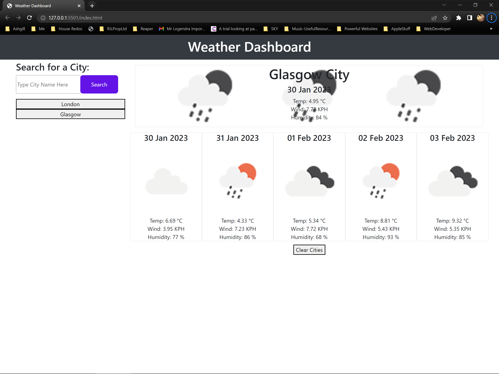

# Weather_Dashboard
Weather Dashboard that runs in a browser to present 5 Day Weather Forecast with user input form

## Table of contents

- [Overview](#overview)
  - [The challenge](#the-challenge)
  - [Screenshot](#screenshot)
  - [Links](#links)
- [My process](#my-process)
  - [Built with](#built-with)
  - [What I learned](#what-i-learned)
  - [Continued development](#continued-development)
  - [Useful resources](#useful-resources)
- [Author](#author)
- [Acknowledgments](#acknowledgments)

## Overview

### The challenge

The challenge is to build a weather dashboard that will run in the browser and feature dynamically updated HTML and CSS.
The [Open Weather Map 5 Day Weather Forecast API](https://openweathermap.org/forecast5) is to be used to retrieve weather data for cities. 
The base URL API calls should look like the following: `https://api.openweathermap.org/data/2.5/forecast?lat={lat}&lon={lon}&appid={API key}`.
`localStorage` is to be used to store any persistent data.

  * When a user searches for a city they are presented with current and future conditions for that city and that city is added to the search history
  * When a user views the current weather conditions for that city they are presented with:
    * The city name
    * The date
    * An icon representation of weather conditions
    * The temperature
    * The humidity
    * The wind speed
  * When a user view future weather conditions for that city they are presented with a 5-day forecast that displays:
    * The date
    * An icon representation of weather conditions
    * The temperature
    * The humidity
  * When a user click on a city in the search history they are again presented with current and future conditions for that city


### Screenshot



### Links

- Solution URL: [https://github.com/EDX-IL/Weather_Dashboard](https://github.com/EDX-IL/Weather_Dashboard)
- Live Site URL: [https://edx-il.github.io/Weather_Dashboard/](https://edx-il.github.io/Weather_Dashboard/index.html)

## My process

I began by registering for an account on Open Weather Maps and creating an apikey. I then used the documentation to understand the api/data structures and what i needed for my project. I decided on using the 5 day forecast api. I then created the input and history sections of my project and stored those to local storage. I then used bootstrap cards to display the 5 day forecast as per criteria. I then added the current weather section last to display what the current weather is. I decided to show 12pm each day in the forecast and added a clear histore/cities button in addition to the criteria for a better user experience. 

### Built with

- Semantic HTML5 markup
- Open Weather Map Server API
- CSS custom properties
- Flexbox
- Mobile-first workflow
- local storage
- Javascript


### What I learned

From completing this project i learned how to:
- use server side APIs
- use local storage
- dynamically create html
- use template literals (string literals)


```js
  for (let index = 0; index < localStorage.length; index++) {
    var city = localStorage.key(index);
    //add button for each city under historyEL-set unique ID attribute
    let newButtonEl = document.createElement("button", (id = "TAG"));
    newButtonEl.textContent = city;
    newButtonEl.setAttribute("id", "button-" + city);
    historyEl.append(newButtonEl);
  }>
```

```js
//using backticks to pass variable into url for getting the icons
 let backgroundImageURL = `http://openweathermap.org/img/wn/${todayWeatherIcon}@2x.png`;
```

```js
/* get the function name from within which the function is called. Useful for console.log */
function getFuncName() {
    return getFuncName.caller.name
}

```


### Continued development

I would like to get better at dynamic html and dynamic css. Make my pages more reactive and interactive. And also look better. I think i will look to create some standard buttons etc like i am with standard functions so that my projects don't just look like bootstrap. I will be making the switch to an Apple MacBookPro so getting comfortable with cross platform development is something i want to focus on. Also ahead of the group projects i need to get better at Git and using GitHub. Or maybe that will come from doing the group projects.


### Useful resources

- [OpenWeatherMap Geocoding API](https://openweathermap.org/api/geocoding-api) - This documentation helped me convert the geographical name to co-ordinates
- [OpenWeatherMap 5 Day Forecast API](https://openweathermap.org/forecast5) - This documentation help me understand how to use the API to retrieve the 5 day weather forecast from OpenWeatherMap
- [Local Storage Documentation on MDN](https://developer.mozilla.org/en-US/docs/Web/API/Window/localStorage) - This helped my implement the local storage element on my project.
- [Template Literals](https://developer.mozilla.org/en-US/docs/Web/JavaScript/Reference/Template_literals) - This helped with an explanation of how to use variables in strings using backticks


## Author
  Ian Logendra
- GitHub - [EDX-IL](https://github.com/EDX-IL)


## Acknowledgments

- Dane (Instructor) - Great explanations in class. And very helpful video pre Officer Hours which allowed me to attempt the project having had other distractions this week
- Andrew (TA) - I have health issues both personal and with my wife, so i wasn't able to fully participate in a class, but Andrew was very supportive. Took the pressure of attendance off so i could concentrate on my wife and then come back when i could to this project. 